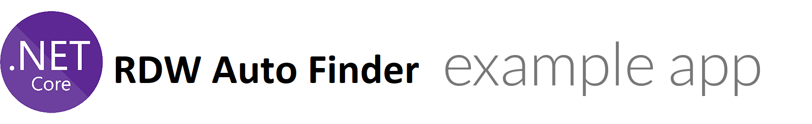

# 

.NET Core codebase containing RDW Auto Finder (a REST API that lets you search on a license plate to retrieve vehicle information). 
The information about license plate is coming from the following API's: 
[Open Data RDW: Gekentekende_voertuigen | Open Data |RDW](https://opendata.rdw.nl/Voertuigen/Open-Data-RDW-Gekentekende_voertuigen/m9d7-ebf2)

## How it works

This is using ASP.NET Core with:

- [AutoMapper](http://automapper.org)
- Built-in Swagger via [Swashbuckle.AspNetCore](https://github.com/domaindrivendev/Swashbuckle.AspNetCore)
- [SODA](https://dev.socrata.com/) for RDW request
- ApiKey authentication(only one APIKey available **pgH7QzFHJx4w46fI**)
- DDD API Achitecture 
- Production ready API - Different .NET Configuration, ExceptionMiddileWare and Logging

## Getting started

Install the .NET Core SDK 6.0 Long Term Support: [https://www.microsoft.com/net/download/core](https://www.microsoft.com/net/download/core)

## How to Run

Choose Configuration : **Dev or Prod**

Build Solution with configuration: **dotnet build --configuration Dev**

Run local API: **dotnet run --project "AutoFinder.API.csproj" --configuration Dev --launch-profile "AutoFinder.API"**

API Swagger UI will be available on browser: **[https://localhost:7062/swagger/index.html](https://localhost:7062/swagger/index.html)**

## Swagger and API Run

For Authorizations in Swagger use APIKey: **pgH7QzFHJx4w46fI**

For RDW request use: **RdwAutoFinder HTTPGET endpoint**

Parameters can be combination or only one:

**plateNumber**: begining of plate license number

**brand**: Car brand in uppercase

**autoType**: please use those values: "Aanhangwagen", "Personenauto", "Land- of bosbouwtrekker" ...

## Itegration and unit tests

Unit tests project: **AutoFinder.Application.UnitTests**

Integration tests project: **AutoFinder.IntegrationTests** - customise API url in **\AutoFinder.IntegrationTests\TestData\TestSettings.json**

## Application monitoring in production

Logs available on: **\logs\AutoFinderAPI.log**

For best production monitoring can be setup: **New Relic, Raygun etc.**
